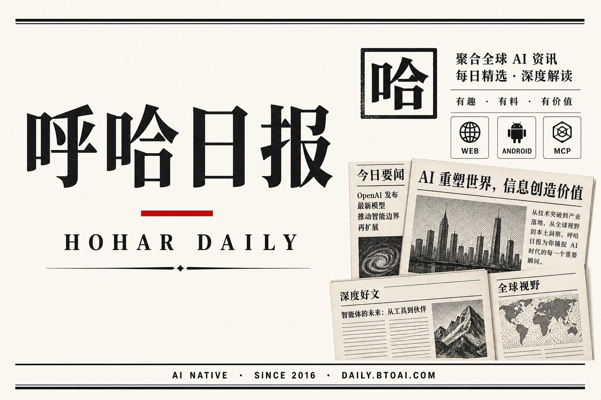
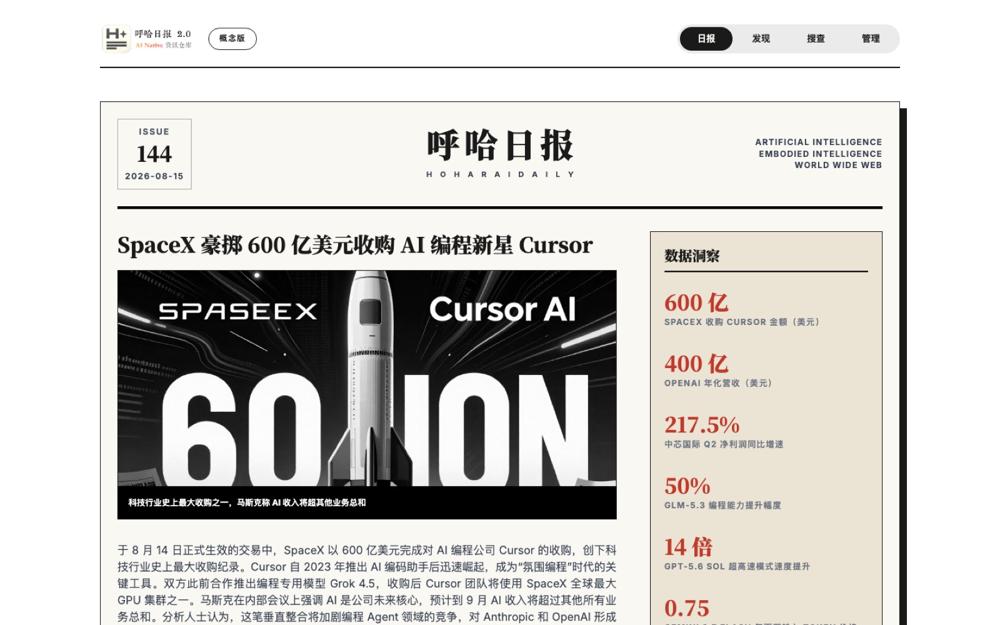
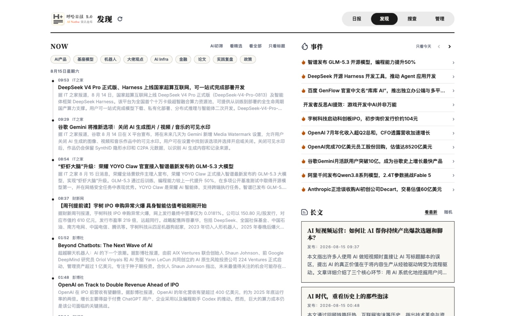
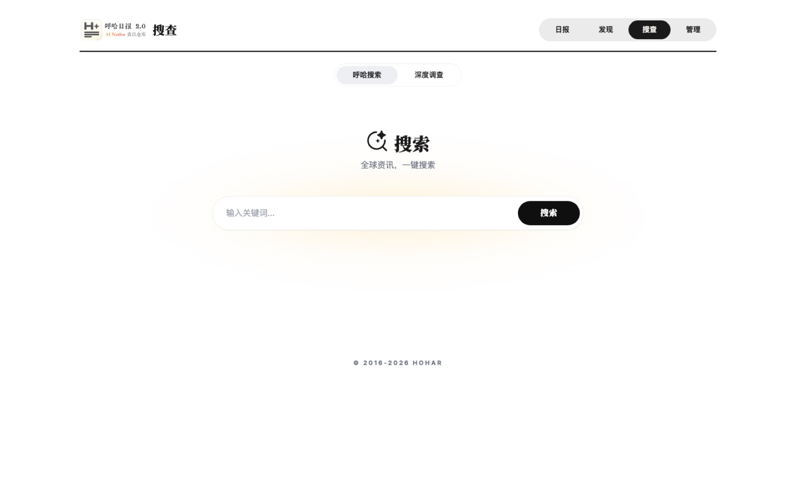
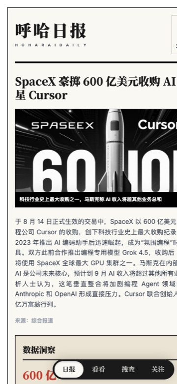
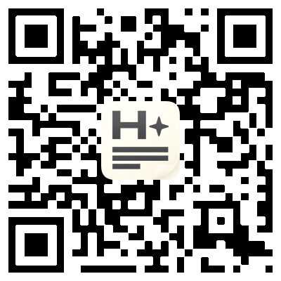

  

<h1 align="center">呼哈日报</h1>

  <b>AI Native 资讯仓库</b> 
  网页 · 安卓 · MCP

  
  
  
  

  <a href="https://daily.btoai.com"><b>打开网页</b></a>
  ·
  <a href="https://www.pgyer.com/aidaily"><b>下载安卓</b></a>

  

24×7 采集全球科技资讯，经 AI Agent 编辑与排版，每天 **UTC+8 7:00** 出一份日报。聚焦人工智能、具身智能、互联网。品牌可追溯至 2016。

> 本仓库仅作产品介绍，不包含源代码。

---

## 网页版

打开 [daily.btoai.com](https://daily.btoai.com) 即可阅读。

  

| 栏目 | 做什么 |
| --- | --- |
| **日报** | AI 生成头条、深度、简讯、数据洞察；可听 AI 播客；报刊架翻阅往期 |
| **发现** | NOW 资讯流（AI 初筛 / 精选）+ 事件时间轴 + 长文 |
| **搜查** | 呼哈搜索（库内检索 + AI 速览）/ 深度调查（联网写报告 + 追问） |

  
  

基座模型：DeepSeek、GLM。资讯请自行甄别。也支持飞书群订阅。

---

## 安卓版

内测中。网页能力之外，还有 **AI 播客、呼哈搜索、阅读管理、推送**。

  
  &nbsp;&nbsp;
  

  扫码或打开 <a href="https://www.pgyer.com/aidaily">pgyer.com/aidaily</a> 
  下载邀请码 <code>hohar</code>　·　注册邀请码 <code>HOHAR</code>

---

## MCP

给 Agent 重度用户：把呼哈日报接到 Cursor / Claude 等客户端。

| 工具 | 说明 |
| --- | --- |
| 呼哈搜索 | AI 增强检索，全球最新资讯 |
| 呼哈日报全文 | 按日期取当日 / 指定期日报 |
| 12H 快讯 | 最近 12 小时资讯 |
| 全球 AI 资讯 | 按模型 / 产品 / 行业 / 论文 / 技巧分类拉取 |

申请体验：邮件 **ph#btoai.com**（把 `#` 换成 `@`）。

---

## 说明

个人学习 Demo，不涉及商业用途。问题或合作同样发到上面的邮箱。

© 2016–2026 HoHar
