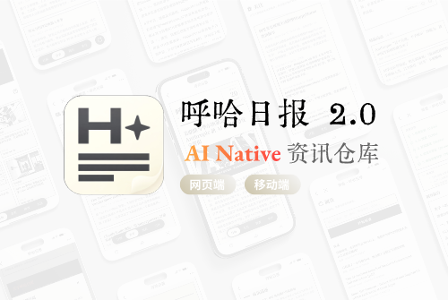
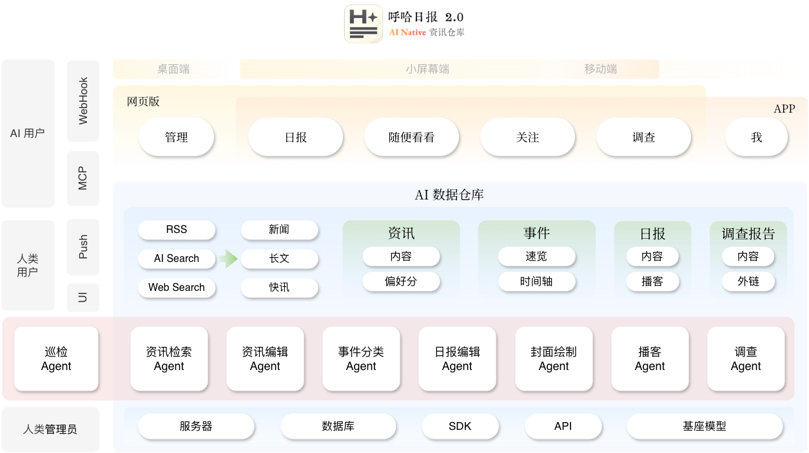

  

<h1 align="center">呼哈日报</h1>

  <b>AI Native 资讯仓库</b> 
  网页 · 安卓 · MCP

  
  
  
  

  <a href="https://daily.btoai.com"><b>打开网页</b></a>
  ·
  <a href="https://www.pgyer.com/aidaily"><b>下载安卓</b></a>

  

## 产品介绍

资讯，是指某个时间发生了什么事情，而不是某个时间你需要知道什么事情。针对个人用户的推荐算法是不健康的产物。把信息简单过滤、展示出来，剩下的让人类自己思考。

**是资讯服务于人的认知，而非人的欲望服务于资讯的流量。**

**「呼哈日报 2.0」** 是一款 AI 原生的资讯仓库，深度聚焦人工智能、具身智能、互联网等领域。品牌可追溯至 2016 年。仓库 24 小时全网采集，经由 AI 编辑与排版，自动化产出日报，并配套极速检索与订阅。通过「采集 — 生成 — 分发」全链路智能化，为科技爱好者、从业者、研究机构提供可信的信息获取体验。

## 什么是 AI 原生

不同于传统资讯分发 / 聚合应用，AI 从底层接管整个数据仓库：

  

平台接入国产大模型 **GLM-5.2**、**DeepSeek V4**，以及 **Qwen-Image**、**Doubao** 语音大模型，完成推理与生成；同时用巡检 Agent 与极少人工介入，保障数据安全、可靠，以及平台稳定运行。

---

## 网页版

打开 [daily.btoai.com](https://daily.btoai.com) 即可阅读。

  

| 栏目 | 做什么 |
| --- | --- |
| **日报** | AI 生成头条、深度、简讯、数据洞察；可听 AI 播客；报刊架翻阅往期 |
| **发现** | NOW 资讯流（AI 初筛 / 精选）+ 事件时间轴 + 长文 |
| **搜查** | 呼哈搜索 / 深度调查 |

  
  

基座模型：DeepSeek、GLM。
支持飞书群订阅。

---

## 安卓版

内测中。拥有网页能力之外，还有 **AI 播客、呼哈搜索、发现、阅读管理等**。

  

  扫码或打开 <a href="https://www.pgyer.com/aidaily">pgyer.com/aidaily</a> 
  下载邀请码 <code>hohar</code>　·　注册邀请码 <code>HOHAR</code>

---

## MCP

给 AI 重度用户：把呼哈日报接到 Agent。

| 工具 | 说明 |
| --- | --- |
| 呼哈搜索 | AI 增强检索，全球最新资讯 |
| 呼哈日报全文 | 按日期取当日 / 指定期日报 |
| 12H 快讯 | 最近 12 小时资讯 |
| 全球 AI 资讯 | 按模型 / 产品 / 行业 / 论文 / 技巧分类拉取 |

申请体验：邮件 **ph#btoai.com**（把 `#` 换成 `@`）。

---

## 说明

个人学习 Demo，不涉及商业用途。问题或合作同样发到上面的邮箱。

© 2016–2026 HoHar
